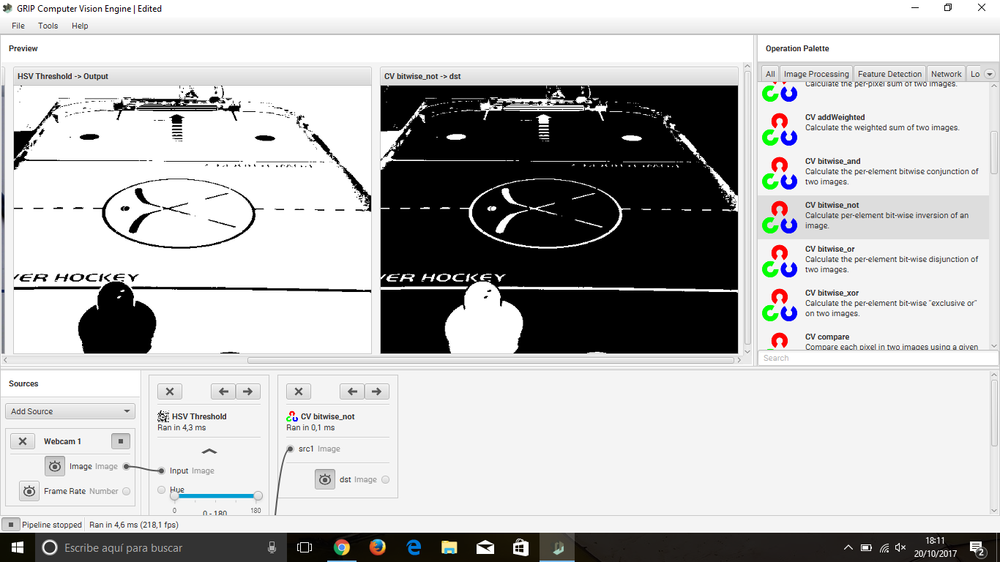

## Computer Vision

Prototipo de visión por computador.
Uso de GRIP para programación algoritmos de visión por computador usando bloques. Generación automática de código en C++, Python o Java , librerías OpenCV.

Figura 1. Filtro de rango
