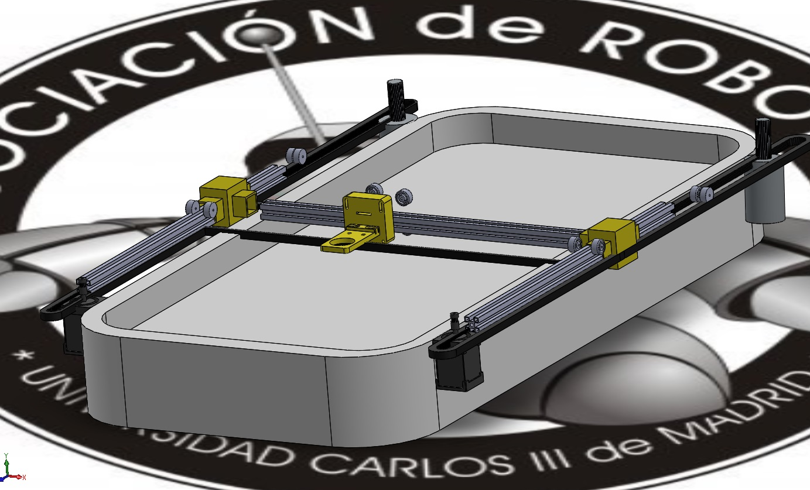

# Modelado 3D y Assembly realizado en SolidWorks

En el siguiente directorio se pueden encontrar los componentes 3D, planos acotados y el Assembly realizados mediante SolidWorks.

Figura 1. Assembly

Figura 2. Ejemplo de plano
